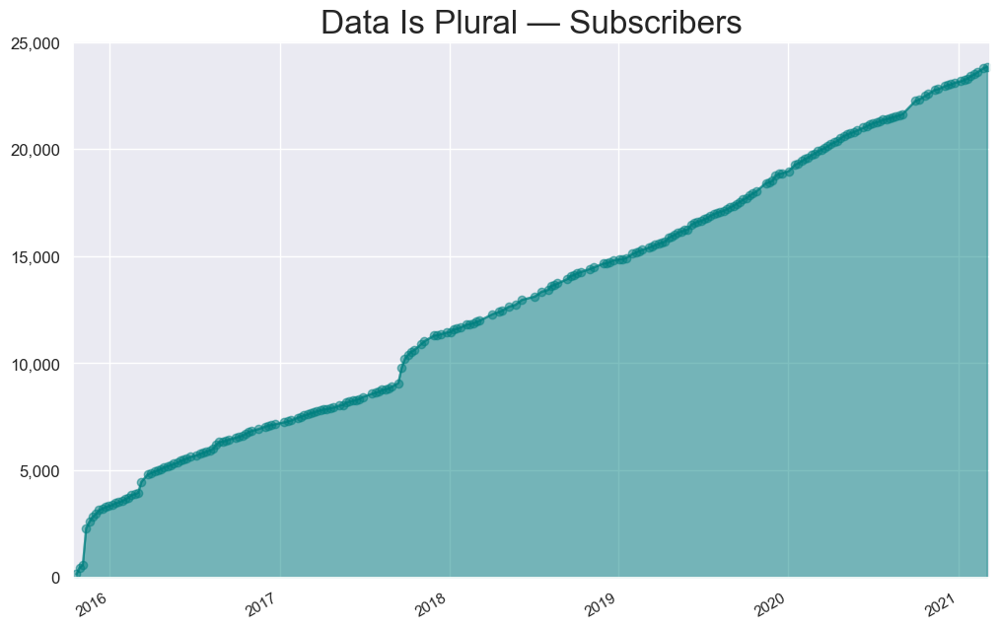
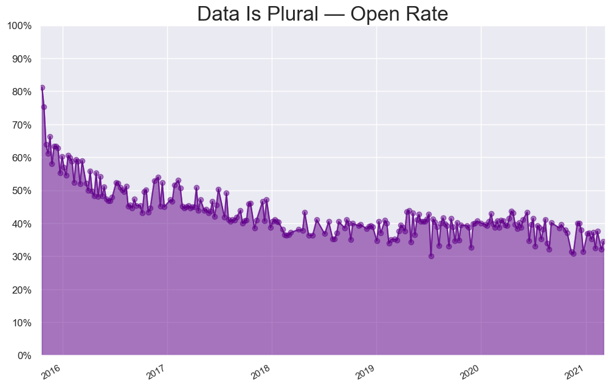
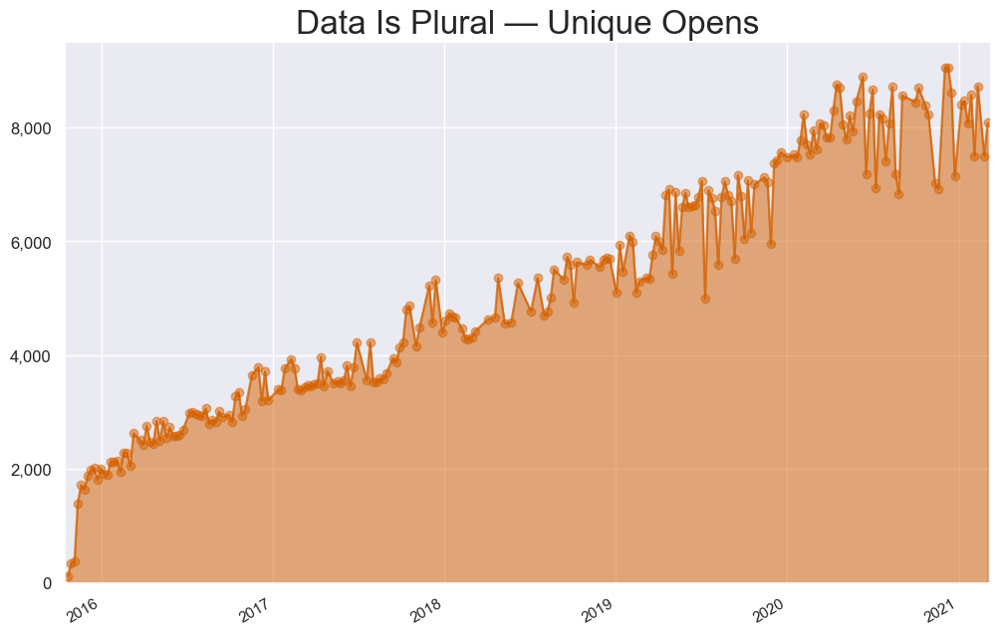

# Data Is Plural: Newsletter Stats

Each weekly edition of [Data Is Plural](https://tinyletter.com/data-is-plural) features five useful/interesting datasets (or groups of related datasets). This repository contains [statistics for each published edition](data/messages.csv), derived from [TinyLetter's undocumented API](https://github.com/jsvine/tinystats).

## Subscribers

This [autogenerated](scripts/make-chart-subscribers.py) chart tracks the number of subscribers who received each edition:

#### Notes

- November 2015 spike coincided with announcements on [NICAR-L](https://www.ire.org/resource-center/listservs/subscribe-nicar-l/) and [Hacker News](https://news.ycombinator.com/item?id=10513012).

- March 2016 spike coincided with a [nice Poynter article about the newsletter](http://www.poynter.org/2016/meet-the-buzzfeed-editor-that-data-journalists-love/400553/).

- September 2017 spike coincided with DIP being mentioned in [Fast Company's "9 Newsletters To Make You Smarter"](https://www.fastcompany.com/40457819/9-newsletters-to-make-you-smarter) and in [Paul Bradshaw's list of newsletters about data](https://onlinejournalismblog.com/2017/09/19/email-newsletters-about-data-journalism/).

## Open Rate

This [autogenerated](scripts/make-chart-open-rate.py) chart tracks each edition's "open rate" — the percentage of subscribers whom TinyLetter detected as having opened the newsletter:

## Unique Opens

This [autogenerated](scripts/make-chart-unique-opens.py) chart tracks each edition's total "unique opens" — the number of subscribers whom TinyLetter detected as having opened the newsletter:

## Explore the data

You can [explore the raw data here](data/messages.csv). It contains the following fields:

- `id`
- `stub`
- `subject`
- `sent_at`
- `sent_at_date`
- `send_count`
- `stats.total_opens`
- `stats.total_clicks`
- `stats.unique_opens`
- `stats.unique_clicks`
- `stats.open_rate`
- `stats.click_rate`
- `stats.soft_bounces`
- `stats.hard_bounces`
- `stats.spam_complaints`
- `stats.unsubs`

See anything interesting? Let me know! ([Contact information here](http://jsvine.com).)
